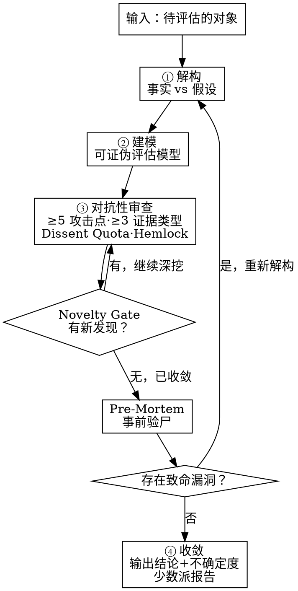

# 驳真 — 从第一性原理评估需求真伪与市场

<HARD-GATE>
在没有完成完整的对抗性审查（至少 5 个独立攻击点，覆盖至少 3 种不同的证据类型）之前，不得输出最终结论。
对抗性审查不是"找问题来反驳"，而是"假设自己错了，然后证明为什么错"。
如果你觉得自己已经知道答案了，那正是你最需要走完这个流程的时候。
</HARD-GATE>

## 核心流程

```
① 解构 → ② 建模 → ③ 审查 → ④ 收敛
         ↑_____________|（循环，经过 Novelty Gate 检验）
```

## Anti-Pattern: "这个需求一眼就能看出来，不需要分析"

每个想法、每个需求、每个方向都走完整流程。

"简单的需求"恰恰是隐藏假设最多的地方——因为你以为你已经懂了，所以你不会去挑战它。**越"明显"的结论，越需要对抗性审查。**

一个"一眼看上去就觉得对"的需求，通常是因为它符合你的确认偏误，而不是因为它真的对。

走完流程并不需要很长时间。如果需求是真的，流程会让它更坚固。如果是假的，流程帮你省下几个月的时间。

---

## 第一步：解构

### 目的
把评估对象分解到**不可再分的基本事实和隐藏假设**，区分哪些是已知事实、哪些是未经检验的假设。

### 操作指南

**1. 列出所有已知事实** — 已经发生且无可争议的内容

```
事实的特征：
- 可以被第三方独立验证
- 不依赖解读或推断
- 示例："有 10 个用户下载了"→ 事实
         "用户觉得有用" → 不是事实，是推断
```

**2. 剥离隐藏假设** — 将"我以为…"变成明确的待验证项

```
常见的隐藏假设类型：
├── "用户需要 XXX" → 用户告诉你的？还是你猜的？
├── "这个痛点很明显" → 用户在用替代方案吗？
├── "用户会愿意付费" → 你问过吗？
├── "这个功能没人做" → 是真的没人做？还是你找不到？
└── "用户会改变习惯来用" → 历史上几乎所有产品都高估了这个
```

**3. 标记不确定性** — 对每个判断标注置信度

```
✅ 有数据支撑的事实
⚠️ 有间接证据但未直接验证
❌ 纯属推测
```

### 输出
一份清晰的**事实 vs 假设清单**，每项有置信度标记。

---

## 第二步：建模

### 目的
构建一个**可证伪、可衡量**的评估模型。模型本身不是结论，而是用来推导结论的工具。

### 核心参考模型：需求真伪三维评估

这是最常用的模型，但不是唯一模型。**根据评估对象的类型，可以调整维度。** 关键要求是：每个维度必须可被事实推翻（可证伪）。

```
真需求 ≈ 痛苦(Pain) × 频率(Frequency) × 替代方案不满意(Dissatisfaction)
```

| 维度 | 第一性原理定义 | 可证伪的判定方式 |
|------|--------------|-----------------|
| **痛苦 (Pain)** | 用户不解决此问题，每次会损失什么？ | 如果用户不用该方案也"活得很好"，则痛点为低 |
| **频率 (Frequency)** | 这个选择场景多久出现一次？ | 如果每天 < 1 次，需要极高单次价值来弥补 |
| **替代方案不满意 (Dissatisfaction)** | 用户实际（非理论上）在用什么替代方案？ | 如果替代方案是"什么都不做"，则不满意度为 0 |

### 关键原则

- ❌ **不要用"理论上能用的方案"去分析替代方案**，要用"用户实际在用的方案"
- ❌ **不要混淆"首次使用"和"持续使用"**——真需求的标志是留存，不是下载
- ❌ **不要回避打分**——每个维度给出明确评估，宁可粗也要明确
- ✅ **标注每个打分是基于"事实"还是"假设"**
- ✅ **如果你发现自己在调整模型来让结论更"合理"，你已经在维护预设结论了**

### 可选模型（根据不同场景选用）

```
场景 A：评估一个"已有方案"为什么没人用
→ 模型 = 初始吸引力 × 留存驱动力 × 流失原因

场景 B：评估一个"新产品想法"是否值得做
→ 模型 = 问题频率 × 现有方案空白 × 技术能否做得比别人好 10 倍

场景 C：评估一个"商业模式"是否成立
→ 模型 = 获客成本 × 用户生命周期价值 × 规模天花板

场景 D：评估一个"团队内部工具"需求
→ 模型 = 不做此事的后果 × 替代方案成本 × 开发维护成本
```

**选择哪个模型取决于对象的性质。** 如果不确定，先用最通用的"真需求三维评估"。

---

## 第三步：对抗性审查 ⚠️ 这是本技能的核心价值所在

### 目的
强制切换立场，从"辩护者"变成"攻击者"，主动寻找最致命的漏洞。

> **如果你找不到至少 3 个真正的致命漏洞，说明你没有在真正做对抗性审查。**
> **真正的对抗性审查应该让你对自己的结论感到不舒服。**

### 攻击点必须标注证据类型（Evidence Label）

每个攻击点必须标注其证据类型，确保视角足够多元化。
**至少覆盖 3 种不同类型**，否则审查视角不合格。

```
🔬 经验性（Empirical）— 基于数据、观察、历史事实
   例："已有产品 A/B/C 都失败了，说明市场可能有问题"

⚙️ 机制性（Mechanistic）— 基于系统运作逻辑、因果链
   例："如果巨头顺手把这个功能内置了，独立产品就失去了存在价值"

🎯 战略性（Strategic）— 基于竞争格局、市场结构
   例："这个赛道的获客成本远高于用户生命周期价值"

⚖️ 伦理性（Ethical）— 基于隐私、信任、合规、社会责任
   例："用户不会信任一个读取聊天记录的第三方工具"

💡 启发性（Heuristic）— 基于模式类比、直觉推理
   例："这个模式跟十年前某产品的失败路径非常相似"
```

### 操作指南

1. **假设自己是产品的对手、质疑者、投资人、用户（不同视角）**
2. **寻找至少 5 个独立的攻击点**，每个点对应不同的视角和不同的证据类型
3. **每个攻击点逐条展开**，标注：
   - 证据类型标签（🔬 ⚙️ 🎯 ⚖️ 💡）
   - 攻击的核心逻辑
   - 严重度标记（🔴🔴🔴🔴🔴 致命 ~ 🟢 轻微）
4. **维护一个"已关闭议题清单"（Hemlock Rule 适配）**
   - 当某个攻击点已被充分讨论并收录进模型修正 → 标记为 🔒 已关闭
   - 后续循环不得再攻击同一个点（除非出现了全新的证据）
   - 确保每次循环都在挖掘"新伤口"，而不是"同一个伤口反复戳"

5. **强制切换正反立场（Dissent Quota 适配）**
   - 如果你在前 3 个攻击点中全部在否定这个需求 → 第 4 个攻击点必须切换到"辩护方"立场
   - 如果你在前 3 个攻击点中全部在支持这个需求 → 第 4 个攻击点必须切换到"质疑方"立场
   - 必须保证正反两面都被充分审视，不能"一面倒"

6. **每轮审查完成后运行 Novelty Gate（新颖性门控）**
   - 本轮审查是否至少发现了 **1 个在上一轮中不存在的新攻击点**？
   - 如果"是" → 说明还有未被挖掘的维度，本轮有价值
   - 如果"否" → 说明审查已经收敛，可以结束循环进入第四步

7. **审查完成后，运行一次 Pre-Mortem（事前验尸）**
   - 假设基于当前结论去执行了，12 个月后灾难性地失败了
   - **最可能的三个失败原因是什么？**
   - 这个练习能挖出前面可能忽略的"低频但高影响"的风险

8. **汇总"最致命的一个攻击点"** — 如果这个点无法解决，整个结论就不成立

---

## 第四步：收敛

### 目的
基于审查结果修正模型，输出**带不确定性标记**的最终结论。

### 操作指南

1. **标记漏洞类型**
   - 🔴 致命漏洞 → 结论可能不成立，需要回到第一步重新解构
   - 🟡 重要漏洞 → 结论需要调整，但方向可能不变
   - 🟢 次要漏洞 → 快速修正即可，不影响整体结论
   - 🔒 已关闭 → 该点已在上一轮审查中被充分讨论并纳入模型

2. **更新模型**
   - 根据审查中发现的问题调整维度权重
   - 修正被误解的基本事实
   - 补充之前忽略的维度

3. **输出最终判定**（必须包含以下六项）

### 输出格式

```markdown
## 最终判定

**结论**：[真需求 / 弱需求 / 伪需求 / 需要更多数据]

**最致命的问题**：[一句话概括对抗性审查中发现的最大漏洞]

**不确定性程度**：[高 / 中 / 低]
（低 = 结论非常稳固，极难被推翻；高 = 结论建立在多个未验证假设之上，随时可能翻盘）

**推翻此结论需要的新证据**：[具体可验证的条件]
（如果某天出现了什么数据或事实，这个结论就不成立了）

**少数派报告**：[即使结论如此，最可能让这个结论翻盘的原因是……]
（防止输出被过度收敛成单一信条。记录"如果这个结论是错的，最可能的原因是什么"）

**后续建议**：[继续 / 放弃 / 先验证什么 / 换方向 / 做什么能改变结论]
```

---

## 对抗性审查速查

每一轮对抗性审查的执行清单：

```
□ 本次攻击覆盖了至少 3 种证据类型？（🔬⚙️🎯⚖️💡 至少选 3）
□ 本次攻击没有重复"已关闭议题"？（检查 🔒 清单）
□ 如果前几轮立场是一致的，本轮切换了正反立场？（Dissent Quota）
□ 本轮发现了至少 1 个新攻击点？（Novelty Gate）
□ 运行了 Pre-Mortem（事前验尸）？
□ 汇总了最致命的一个攻击点？
```

---

## 危险信号 — 你在跳过对抗性审查

如果你发现自己正在想：

- "其实这个需求不用分析也能看得出来"
- "走个流程就行，我知道结论是什么"
- "先给结论，对抗性审查走个过场"
- "分析太复杂了，简单讲一下就行"
- "用户已经用了，说明需求是真的"（留存数据呢？）
- "这个需求太简单了，不需要审查"
- "时间紧，先跳过审查，回头再补"
- "我已经很客观了，不需要刻意换立场"
- "这个点太小了，应该不会影响结论"

**以上任何一个想法出现 → 立即回到对抗性审查阶段。** 你的大脑正在试图跳过最痛苦的环节（挑战自己的结论），而这恰恰是这个流程唯一不可省略的环节。

### 用户发出的信号

当用户说以下话时，说明你在"维护预设结论"而非"从第一性原理分析"：

| 用户说 | 你的问题 |
|--------|---------|
| "你是不是在帮我找理由说服自己？" | 你的分析偏向于确认，而非挑战 |
| "你再挑点刺" | 你的审查不够深入，停留在了表面 |
| "换个角度想想" | 你只站在了一个视角看问题 |
| "这个假设你怎么验证？" | 你把未经检验的假设当成了事实 |
| "你是不是已经有结论了？" | 你的分析是事先有了答案再找证据 |

---

## 常见自我说服（Common Rationalizations）

| 你会这样说服自己 | 事实是 |
|-----------------|--------|
| "用户需要这个功能，很明显的" | 用户"感兴趣" ≠ 用户"需要"。兴趣免费，需要付费 |
| "没有人在做这个" | 更可能是：没人找到可行的方案，或者这个需求根本不够强 |
| "用户已经在用我的产品了" | 下载 ≠ 留存。活跃留存率才是唯一指标 |
| "Siri 不好用/不够好" | Siri 的使用率低 ≠ 用户会用一个第三方工具替代。不做一件事的惯性远强于"找一个更好的方案" |
| "这个痛点很多人都提过" | 吐槽 ≠ 付费意愿。人们吐槽很多事，但只为少数事买单 |
| "AI 技术解决了这个问题" | 技术能解决"怎么做"，不等于有人需要"做什么" |
| "只要体验好一点，用户就会迁移" | 需要 10 倍体验提升才值得用户改变习惯。1.5 倍的优化不足以驱动迁移 |
| "等我上线了，用户会来的" | 获客是这个世界上最难的事之一。用户不会主动来，你需要把他们拉来 |
| "我看了正反两面，已经很客观了" | 如果你没有故意让自己不舒服，那就是没有在做对抗性审查 |
| "这个点已经讨论过了" | 真的已经充分讨论了还是你不想再深入了？检查是否已标记 🔒 |

---

## 流程总图



---

## 速查表（Quick Reference）

| 阶段 | 关键活动 | 成功标准 |
|------|---------|---------|
| **① 解构** | 列出事实 vs 假设；标注置信度 | 区分清楚"已知"和"以为" |
| **② 建模** | 选择/构建可证伪模型；逐维度打分 | 每个维度都标注了它是"事实"还是"假设" |
| **③ 审查** | ≥5 个攻击点、≥3 种证据类型、切换正反立场、Novelty Gate、Pre-Mortem | 找到了至少 1 个让你不舒服的漏洞 + Novelty Gate 通过 |
| **④ 收敛** | 修正模型；标注不确定性；输出结论+少数派报告 | 结论附带"推翻它需要什么证据"和"最可能翻盘的原因" |

---

## 适用边界

### Dialectic 适合评估的问题

Dialectic 是一个**逻辑分析框架**——它通过结构化推理来暴露隐藏假设、对抗确认偏误。它适合解决以下类型的问题：

```
✅ "这个需求是真还是伪？"
✅ "这个方向值不值得投入？"
✅ "这个产品为什么没人用？"
✅ "我的论证中有没有漏洞？"
✅ "我的假设中哪些可能不成立？"
```

这些问题的共同特征：答案可以通过**已有事实 + 逻辑推演**得出。

### Dialectic 不适合评估的问题

Dialectic **不能替代**以下类型的判断：

```
❌ 需要实地验证的问题
   → "用户点击这个按钮更多还是蓝色更多？" → 跑 A/B 测试
   → "这个定价用户能接受吗？" → 做定价实验
❌ 依赖非逻辑信息的问题
   → "现在是不是入场的好时机？" → 需要市场直觉和 timing 判断
   → "这个合伙人靠不靠谱？" → 需要人际信任和相处经验
❌ 审美/品味的判断
   → "这个设计好不好看？" → 主观判断
❌ 极端时间压力下的紧急决策
   → "服务器宕机了，先重启还是先查日志？" → 需要经验直觉
```

**如果问题属于以上类型，跑 Dialectic 流程既浪费时间又可能导致错误结论。** 在开始之前先问自己："这个问题通过逻辑分析能得出可靠结论吗？" 如果不能，换个方法。

### 方法论不能替代实地验证

Dialectic 最有价值的用法之一，是告诉你"这个需要去验证"——而不是让你以为你已经分析完了。

如果一个问题可以通过一个简单实验来回答，永远优先做实验。

---

## 输入质量标准（Input Quality Gate）

Dialectic 的输出质量直接由输入质量决定。**GIGO（Garbage In, Garbage Out）**——一个完美的流程加上错误或模糊的事实，等于完美的错误。

在进入流程之前，先检查你的输入是否达到了以下标准：

### 标准 1：你是否有"可验证的事实"？

```
✅ 好输入："小胶囊有 10 个用户，使用率不高，来自自然流量"
   → 这些都是可以独立验证的事实

❌ 差输入："用户需要一个更好的记录工具"
   → 这不是事实，这是你的推断
   → 跑流程之前，先把这种断言拆解为可验证的假设

如果 80% 以上的输入是推测而不是事实，
先去做调研获取事实，而不是跑流程。
```

### 标准 2：你的问题是否足够具体？

```
✅ 好问题："做一个 AI 生成周报的工具，需求真伪如何？"
   → 有明确的对象、场景

❌ 差问题："做一个 AI 工具怎么样？"
   → 太模糊，解构无法落地

如果问题太空泛，先缩小范围再跑流程。
一个好的测试：你能不能用 10 个字描述清楚你在评估什么？
如果不能，问题还不够具体。
```

### 标准 3：你是否愿意接受"这个需求不成立"的结论？

```
Dialectic 的价值不在于证明你想的是对的，
而在于找出你可能错在哪里。

如果你潜意识里已经认定了答案，
跑流程只是为了"得到支持"→
你不仅会浪费自己的时间，还会因为"我过了流程"而更加固执。

在开始之前做一个"诚实测试"：
"如果结论是这个想法不值得做，我会接受吗？"

如果答案是不会 → 先不要跑流程。你现在不想要分析，你想要确认。
```

### 标准 4：这个问题是否能用逻辑分析得出答案？

对照上面的"适用边界"检查：
- 这个问题需要实地数据吗？→ 去跑实验
- 这个问题依赖不可知信息吗？→ 先获取关键信息
- 这个问题是纯主观判断吗？→ 不需要分析

### 输入质量检查清单

在开始任何一次 Dialectic 流程之前，快速检查：

```
□ 我至少有 3 个可验证的事实作为分析的起点
□ 我的问题具体到 10 个字能说清楚
□ 我做好了"可能得到否定结论"的心理准备
□ 这个问题适合用逻辑分析（不是需要实验/直觉/审美判断）
□ 如果我错了，我愿意接受这个结果
```

**至少 4/5 通过才能开始。否则先去做前置工作（调研、明确问题、调整心态）。**

---

## 核心原则

1. **只区分事实和假设** — 其他一切判断都可以错，唯有这个区分不能模糊
2. **模型必须可证伪** — 如果一个维度无法被事实推翻，它就不应该出现在模型里
3. **对抗性审查是核心** — 没有经过真正对抗性审查的结论，本质上还是猜测
4. **结论必须附带不确定度** — 只输出确定结论的分析不是分析，是信仰
5. **复盘自己的分析链路** — 每轮分析结束后，检查自己是否在 unconsciously 维护预设结论
6. **找不到三个致命漏洞 = 你没有在做对抗性审查**
7. **Novelty Gate — 如果你只是在重复已有的论点，说明审查已经收敛，该结束了**
8. **Dissent Quota — 如果你只在攻击一个方向，你其实是在找论据，不是在审查**
