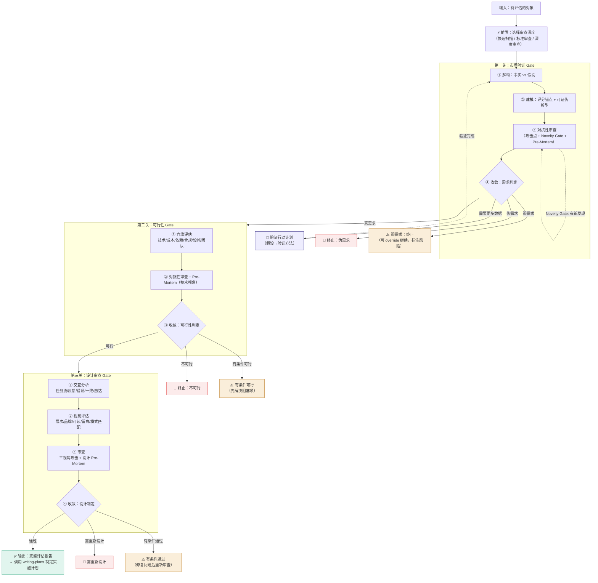

# 驳真 — 产品决策三段式审查漏斗

<HARD-GATE>
在没有完成对抗性审查（按所选审查深度：⚡≥2 / 📋≥3 / 🔬≥5 个独立攻击点，覆盖对应深度的证据类型）之前，不得输出最终结论。
对抗性审查不是"找问题来反驳"，而是"假设自己错了，然后证明为什么错"。
如果你觉得自己已经知道答案了，那正是你最需要走完这个流程的时候。
</HARD-GATE>

## 总览

```
输入：一个产品想法 / 新功能 / 决策方向
              │
              ▼
┌─────────────────────────────┐
│  第一关：市场验证 Gate       │ ← 需求是真的吗？（现有驳真核心）
└──────────┬──────────────────┘
           │ 通过
           ▼
┌─────────────────────────────┐
│  第二关：可行性 Gate         │ ← 技术上能做吗？成本/依赖/风险？
└──────────┬──────────────────┘
           │ 通过
           ▼
┌─────────────────────────────┐
│  第三关：设计审查 Gate        │ ← 交互和视觉怎么做？
└──────────┬──────────────────┘
           │ 通过
           ▼
     输出：完整评估报告
（任一关卡失败即终止，输出对应结论）
```

**任一关卡被驳倒，后续关卡自动终止。** 结论与流转的映射关系：

| 第一关结论 | 流转 | 说明 |
|-----------|------|------|
| **真需求** | → 进入第二关 | 市场信号足够强，值得评估可行性 |
| **弱需求** | → 终止（可 override） | 默认终止；若用户明确要求继续，进入第二关但需标注「市场风险前置」 |
| **需要更多数据** | → 暂停，不前进 | 执行验证行动计划，收集数据后重新评估第一关 |
| **伪需求** | → 终止 | 已确认不值得做，不进入任何后续关卡 |

## 核心流程

```
第一阶段：市场验证 Gate
  ① 解构 → ② 建模 → ③ 对抗性审查 → ④ 收敛判定
           ↑_____________|（循环，经 Novelty Gate 检验）
  │
  ├── 通过 → 进入第二阶段
  └── 失败 → 终止，输出结论

第二阶段：可行性 Gate
  ① 技术解构 → ② 风险评估 → ③ 对抗性审查 → ④ 收敛判定
  │
  ├── 通过 → 进入第三阶段
  └── 失败 → 终止，输出结论

第三阶段：设计审查 Gate
  ① 交互分析 → ② 视觉规范 → ③ 审查 → ④ 设计收敛
  │
  └── 输出：完整产品评估报告
```

## 审查深度分级（前置选择）⚡

在开始之前，先根据**决策的重要性和可逆性**选择审查深度，避免"一刀切"。

### 前置判定：我需要多深？

```
快速回答两个问题：

1. 这个决策的错误成本有多大？
   - $ / 时间 / 声誉 / 合规风险
2. 是否存在不可逆的承诺？
   - 合同签约 / 大规模开发投入 / 团队组建
```

**决策后选择模式：**

| 错误成本 | 可逆性 | 推荐深度 | 标志 |
|---------|--------|---------|------|
| 高 | 不可逆 | 🔬 **深度审查** | 新产品、战略方向、需组建团队 |
| 中 | 部分可逆 | 📋 **标准审查** | 新功能模块、中等开发投入 |
| 低 | 完全可逆 | ⚡ **快速扫描** | 小优化、A/B 测试可验证 |

### 三种模式的参数差异

| 参数 | ⚡ 快速扫描 | 📋 标准审查 | 🔬 深度审查 |
|------|-----------|-----------|-----------|
| **第一关攻击点** | ≥2 | ≥3 | ≥5 |
| **第一关证据类型** | ≥2 | ≥2 | ≥3 |
| **第二关攻击点** | 跳过 | ≥2 | ≥3 |
| **第二关证据类型** | — | ≥2 | ≥2 |
| **第三关** | 跳过 | 跳过（或简略审查） | 完整执行 |
| **Pre-Mortem** | 可选 | 第一关必须 | 每关必须 |
| **少数派报告** | 可选 | 推荐 | 必须 |
| **输出格式** | 段落结论 | 精简版标准格式 | 完整格式 |

> ⚠️ **快速扫描不是为了"偷懒"，而是为了把精力集中在真正重要的决策上。**
> 如果你不知道选哪个，默认选 📋 标准审查。

---

## Anti-Pattern: "这个需求一眼就能看出来，不需要分析"

每个想法、每个需求、每个方向都走完整流程。

"简单的需求"恰恰是隐藏假设最多的地方——因为你以为你已经懂了，所以你不会去挑战它。**越"明显"的结论，越需要对抗性审查。**

一个"一眼看上去就觉得对"的需求，通常是因为它符合你的确认偏误，而不是因为它真的对。

走完流程并不需要很长时间。如果需求是真的，流程会让它更坚固。如果是假的，流程帮你省下几个月的时间。

---

## 第一步：解构

### 目的
把评估对象分解到**不可再分的基本事实和隐藏假设**，区分哪些是已知事实、哪些是未经检验的假设。

### 操作指南

**1. 列出所有已知事实** — 已经发生且无可争议的内容

```
事实的特征：
- 可以被第三方独立验证
- 不依赖解读或推断
- 示例："有 10 个用户下载了"→ 事实
         "用户觉得有用" → 不是事实，是推断
```

**2. 剥离隐藏假设** — 将"我以为…"变成明确的待验证项

```
常见的隐藏假设类型：
├── "用户需要 XXX" → 用户告诉你的？还是你猜的？
├── "这个痛点很明显" → 用户在用替代方案吗？
├── "用户会愿意付费" → 你问过吗？
├── "这个功能没人做" → 是真的没人做？还是你找不到？
└── "用户会改变习惯来用" → 历史上几乎所有产品都高估了这个
```

**3. 标记不确定性** — 对每个判断标注置信度

```
✅ 有数据支撑的事实
⚠️ 有间接证据但未直接验证
❌ 纯属推测
```

### 输出
一份清晰的**事实 vs 假设清单**，每项有置信度标记。

---

## 第二步：建模

### 目的
构建一个**可证伪、可衡量**的评估模型。模型本身不是结论，而是用来推导结论的工具。

### 核心参考模型：需求真伪三维评估

这是最常用的模型，但不是唯一模型。**根据评估对象的类型，可以调整维度。** 关键要求是：每个维度必须可被事实推翻（可证伪）。

```
真需求 ≈ 痛苦(Pain) × 频率(Frequency) × 替代方案不满意(Dissatisfaction)
```

| 维度 | 第一性原理定义 | 可证伪的判定方式 |
|------|--------------|-----------------|
| **痛苦 (Pain)** | 用户不解决此问题，每次会损失什么？ | 如果用户不用该方案也"活得很好"，则痛点为低 |
| **频率 (Frequency)** | 这个选择场景多久出现一次？ | 如果每天 < 1 次，需要极高单次价值来弥补 |
| **替代方案不满意 (Dissatisfaction)** | 用户实际（非理论上）在用什么替代方案？ | 如果替代方案是"什么都不做"，则不满意度为 0 |

### 关键原则

- ❌ **不要用"理论上能用的方案"去分析替代方案**，要用"用户实际在用的方案"
- ❌ **不要混淆"首次使用"和"持续使用"**——真需求的标志是留存，不是下载
- ❌ **不要回避打分**——每个维度给出明确评估，宁可粗也要明确
- ✅ **标注每个打分是基于"事实"还是"假设"**
- ✅ **如果你发现自己在调整模型来让结论更"合理"，你已经在维护预设结论了**

### 可选模型（根据不同场景选用）

```
场景 A：评估一个"已有方案"为什么没人用
→ 模型 = 初始吸引力 × 留存驱动力 × 流失原因

场景 B：评估一个"新产品想法"是否值得做
→ 模型 = 问题频率 × 现有方案空白 × 技术能否做得比别人好 10 倍

场景 C：评估一个"商业模式"是否成立
→ 模型 = 获客成本 × 用户生命周期价值 × 规模天花板

场景 D：评估一个"团队内部工具"需求
→ 模型 = 不做此事的后果 × 替代方案成本 × 开发维护成本
```

**选择哪个模型取决于对象的性质。** 如果不确定，先用最通用的"真需求三维评估"。

---

### 评分锚点校准（Pain/Frequency/Dissatisfaction）

评分不应该"凭感觉"。以下是每个维度的**行为锚点**，对照用户的实际行为来打分，而非你的直觉。

#### Pain 痛苦度锚点

| 分数 | 锚点定义 | 典型信号 |
|------|---------|---------|
| 1-2 | "不解决也没关系" | 从没听用户主动提过这个问题 |
| 3-4 | "不方便，但不影响工作" | 偶尔抱怨，但用临时手段自己消化了 |
| 5-6 | "有明显的效率损失" | 有人自制过工具/脚本/模板来缓解；但还没人愿意为此付费 |
| 7-8 | "严重影响交付质量或合规" | 用户的客户在抱怨、管理层在施压、或者有合规 Deadline |
| 9-10 | "不解决就会出事故" | 有罚款、有法律风险、有已知的事故案例 |

#### Frequency 频率锚点

| 分数 | 锚点定义 | 典型信号 |
|------|---------|---------|
| 1-2 | 一年几次甚至更少 | 年度报告、年度审计 |
| 3-4 | 每月 1-2 次 | 月度汇报、周期性任务 |
| 5-6 | 每周几次 | 例会要用、每周处理 |
| 7-8 | 每天都要用 | 日常工作流的一部分 |
| 9-10 | 全天候、高频复用 | 核心生产工具，不停地在用 |

#### Dissatisfaction 不满意度锚点

| 分数 | 锚点定义 | 典型信号 |
|------|---------|---------|
| 1-2 | "没什么不满的" | 用户从未寻找过替代方案 |
| 3-4 | "有更好的当然好，没有也行" | 知道不够好，但没动力去换 |
| 5-6 | "已经试过换方案但没找到" | 用户表达过不满、搜索过替代品、但还没换 |
| 7-8 | "正在积极寻找替代方案" | 用户已经在试用竞品、或者在寻找解决方案 |
| 9-10 | "现有方案已经停用/无法忍受" | 用户宁可不做这件事也不想用现有工具 |

⚠️ **每个维度的分数必须附带一句话证据。** 不能只写"Pain=6"，必须写"Pain=6，依据：XX 机构反馈手工计算耗时但不出错"。

---

### 需求强度综合判定

| 模型得分范围 | 判定 | 含义 |
|-------------|------|------|
| ≥ 500 | **强需求** | 用户不仅需要，且在积极寻找解决方案 |
| 300-499 | **中等需求** | 存在痛点，但用户会容忍现状直到显著更好的方案出现 |
| 120-299 | **弱需求** | 有痛点但不痛，替代方案基本够用 |
| < 120 | **伪需求** | 解决问题本身可能不是用户真正关心的 |

> ⚠️ **分数是"模型的提示"，不是"决策的答案"。** 最终判定仍需对抗性审查。高分数也可能被一个致命攻击点推翻。

---

## 第三步：对抗性审查 ⚠️ 这是本技能的核心价值所在

### 目的
强制切换立场，从"辩护者"变成"攻击者"，主动寻找最致命的漏洞。

> **如果你找不到真正致命的漏洞，说明你没有在真正做对抗性审查。**
> **真正的对抗性审查应该让你对自己的结论感到不舒服。**

### 攻击点必须标注证据类型（Evidence Label）

每个攻击点必须标注其证据类型，确保视角足够多元化。
**按所选深度覆盖对应数量的证据类型（⚡≥2 / 📋≥2 / 🔬≥3）**，否则审查视角不合格。

```
🔬 经验性（Empirical）— 基于数据、观察、历史事实
   例："已有产品 A/B/C 都失败了，说明市场可能有问题"

⚙️ 机制性（Mechanistic）— 基于系统运作逻辑、因果链
   例："如果巨头顺手把这个功能内置了，独立产品就失去了存在价值"

🎯 战略性（Strategic）— 基于竞争格局、市场结构
   例："这个赛道的获客成本远高于用户生命周期价值"

⚖️ 伦理性（Ethical）— 基于隐私、信任、合规、社会责任
   例："用户不会信任一个读取聊天记录的第三方工具"

💡 启发性（Heuristic）— 基于模式类比、直觉推理
   例："这个模式跟十年前某产品的失败路径非常相似"
```

### 操作指南

1. **假设自己是产品的对手、质疑者、投资人、用户（不同视角）**
2. **寻找独立的攻击点** — 按所选深度确定数量（⚡≥2 / 📋≥3 / 🔬≥5），每个点对应不同的视角和不同的证据类型
3. **每个攻击点逐条展开**，标注：
   - 证据类型标签（🔬 ⚙️ 🎯 ⚖️ 💡）
   - 攻击的核心逻辑
   - 严重度标记（🔴🔴🔴🔴🔴 致命 ~ 🟢 轻微）
4. **维护一个"已关闭议题清单"（Hemlock Rule 适配）**
   - 当某个攻击点已被充分讨论并收录进模型修正 → 标记为 🔒 已关闭
   - 后续循环不得再攻击同一个点（除非出现了全新的证据）
   - 确保每次循环都在挖掘"新伤口"，而不是"同一个伤口反复戳"

5. **强制切换正反立场（Dissent Quota 适配）**
   - 如果你在前 3 个攻击点中全部在否定这个需求 → 第 4 个攻击点必须切换到"辩护方"立场
   - 如果你在前 3 个攻击点中全部在支持这个需求 → 第 4 个攻击点必须切换到"质疑方"立场
   - 必须保证正反两面都被充分审视，不能"一面倒"

6. **每轮审查完成后运行 Novelty Gate（新颖性门控）**
   - 本轮审查是否至少发现了 **1 个在上一轮中不存在的新攻击点**？
   - 如果"是" → 说明还有未被挖掘的维度，本轮有价值
   - 如果"否" → 说明审查已经收敛，可以结束循环进入第四步

7. **审查完成后，运行一次 Pre-Mortem（事前验尸）**
   - 假设基于当前结论去执行了，12 个月后灾难性地失败了
   - **最可能的三个失败原因是什么？**
   - 这个练习能挖出前面可能忽略的"低频但高影响"的风险

8. **汇总"最致命的一个攻击点"** — 如果这个点无法解决，整个结论就不成立

---

## 第四步：收敛

### 目的
基于审查结果修正模型，输出**带不确定性标记**的最终结论。

### 操作指南

1. **标记漏洞类型**
   - 🔴 致命漏洞 → 结论可能不成立，需要回到第一步重新解构
   - 🟡 重要漏洞 → 结论需要调整，但方向可能不变
   - 🟢 次要漏洞 → 快速修正即可，不影响整体结论
   - 🔒 已关闭 → 该点已在上一轮审查中被充分讨论并纳入模型

2. **更新模型**
   - 根据审查中发现的问题调整维度权重
   - 修正被误解的基本事实
   - 补充之前忽略的维度

3. **输出最终判定**（必须包含以下六项）

### 输出格式

```markdown
## 最终判定

**结论**：[真需求 / 弱需求 / 伪需求 / 需要更多数据]

**最致命的问题**：[一句话概括对抗性审查中发现的最大漏洞]

**不确定性程度**：[高 / 中 / 低]
（低 = 结论非常稳固，极难被推翻；高 = 结论建立在多个未验证假设之上，随时可能翻盘）

**推翻此结论需要的新证据**：[具体可验证的条件]
（如果某天出现了什么数据或事实，这个结论就不成立了）

**少数派报告**：[即使结论如此，最可能让这个结论翻盘的原因是……]
（防止输出被过度收敛成单一信条。记录"如果这个结论是错的，最可能的原因是什么"）

**后续建议**：[继续 / 放弃 / 先验证什么 / 换方向 / 做什么能改变结论]
```

### 验证行动计划（关键假设 → 验证方法）

解构阶段标记了大量 ⚠️❌ 的假设。分析不能止步于"这些假设没有被验证"——必须给出**如何验证**的路径。

| 假设类型 | 推荐验证方法 | 成本 | 预期时间 |
|---------|------------|------|---------|
| "用户愿意付费" | 5 次客户深度访谈 + 在访谈末尾讨论价格（不先报价，看用户反应） | 低 | 1-2 周 |
| "竞品没有成功产品" | 桌面调研（App Store、行业报告、知乎/脉脉）+ 2 次行业人士非正式访谈 | 极低 | 3-5 天 |
| "用户不满意现有方案" | 搜索目标用户社区（微信群、知乎、行业论坛）中的负面评价；分析竞品的差评 | 极低 | 3-5 天 |
| "这个场景足够高频" | 已有客户数据抽样分析；或做 1 周的用户行为日记研究 | 低 | 1-2 周 |
| "替代方案是 Excel / 什么都不做" | 观察用户当前工作流（不要问"你会用什么工具"，而要观察他们实际怎么做的） | 低 | 1 周 |
| "监管会强制要求" | 检索最新法规征求意见稿；联系行业内 2-3 位了解政策动态的人 | 低 | 1 周 |
| "技术方案是可行的" | 写一个最小可行性 Demo（不要完整系统，只验证核心计算逻辑） | 中 | 2-4 周 |

> **原则：验证的成本必须远小于"错了"的代价。** 如果一个假设的验证成本接近开发成本，还不如直接做 MVP 来验证。

**验证完成后的判断标准：**
- 如果 ≥3 个关键假设在验证后被推翻 → 考虑终止项目
- 如果 ≥3 个关键假设在验证后被确认 → 需求信号从"弱"升级为"中等"或"强"
- 如果最致命的假设被确认 → 重新跑一轮对抗性审查

### 🚦 第一关流转指令

```
真需求     → 「进入第二阶段：可行性评估」
弱需求     → 「默认终止。如需继续，输入 "override 继续可行性"（将标注市场风险前置）」
需要更多数据 → 「暂停。请先完成验证行动计划中的 [X] 项，收集数据后重新评估」
伪需求     → 「终止评估。不建议继续投入。」
```

---

## 第二阶段：可行性 Gate（Feasibility Gate）

### 进入条件
第一阶段（市场验证）已通过。**如果市场验证失败，直接终止，不必进入此阶段。**

### 目的
从技术、成本、合规、资源等维度评估产品想法的可行性。解决"能不能做""值不值得做""有什么风险"的问题。

### 六维评估模型

| 维度 | 核心问题 | 可证伪的判定方式 |
|------|---------|-----------------|
| **技术复杂度** | 核心功能需要多高的技术门槛？ | 如果团队不具备该技术栈经验，且无法在合理时间内习得，则复杂度高 |
| **开发成本** | 全功能上线需要多少人力 × 时间？ | 如果成本 > 预期收益 × 成功率，则不可行 |
| **第三方依赖** | 是否存在关键依赖（API、SDK、平台政策）？ | 如果依赖方不受控（突然关停、改政策、收费），则该依赖为高风险 |
| **合规与法务** | 是否涉及隐私、资质、行业监管？ | 如果合规成本/风险 > 项目价值，则不可行 |
| **基础设施** | 需要什么样的服务器/带宽/存储/硬件？ | 如果基础设施投入 > MVP 阶段可承受范围，则不可行 |
| **团队匹配度** | 现有团队的能力、带宽、意愿是否匹配？ | 如果核心环节无人能负责（或需要新招核心岗位），则匹配度低 |

### 操作指南

1. **技术解构** — 将产品方案拆解为独立的技术模块/子任务
2. **逐维度评估** — 对每个维度打分（🔴 高风险 / 🟡 中风险 / 🟢 低风险）
3. **标记关键路径** — 识别"如果不解决这个，整个项目无法推进"的阻塞项
4. **对抗性审查（缩减版）** — 按所选深度确定攻击点数量（标准≥2 / 深度≥3），覆盖至少 2 种证据类型
   - 重点攻击评分最高的风险项
   - 假设自己是做竞品的技术负责人：你会怎么评价这个方案？
   - 假设自己是对手公司的投资人：你会指出哪些技术风险？
5. **Pre-Mortem（技术视角）** — 假设项目上线后出现严重技术事故，最可能的原因是什么？

### 输出

```markdown
## 可行性评估结论

**整体判定**：[可行 / 有条件可行 / 不可行]

**关键风险**：[按严重度排序的前 3 项]

**阻塞项**：[如果不解决就无法推进的事项]

**推荐路径**：[建议的技术方案 / 分阶段策略 / 替代方案]

**推翻此结论需要的新证据**：[什么情况下可以推翻可行性结论]
```

### 🚦 第二关流转指令

```
可行        → 「进入第三阶段：设计审查」
有条件可行   → 「先解决阻塞项 [X]，再继续。如需跳过，输入 "override 继续设计"（将标注风险）」
不可行      → 「终止评估。除非 [X] 条件发生改变，否则不建议继续。」
```

---

## 第三阶段：设计审查 Gate（Design Gate）

### 进入条件
第一、二阶段均已通过。**前面任一关卡失败则终止，不必进入此阶段。**

### 目的
从交互逻辑和视觉呈现两个层面评估产品设计，确保体验与市场定位一致。

### 评估框架

#### A. 交互层（Interaction）

| 维度 | 核心问题 |
|------|---------|
| **任务流** | 用户完成核心任务的步骤是否最短路径？ |
| **反馈机制** | 每个操作是否有即时反馈（加载、成功、失败）？ |
| **错误处理** | 用户的错误操作能否优雅恢复？ |
| **一致性** | 同类交互在不同页面是否表现一致？ |
| **无障碍** | 是否考虑了键盘导航、屏幕阅读器、颜色对比度？ |
| **触达成本** | 高频操作是否在用户当前位置 1-2 步内？ |

#### B. 视觉层（Visual）

| 维度 | 核心问题 |
|------|---------|
| **信息层级** | 最重要的信息是否最突出？用户第一眼看到的是否正确？ |
| **视觉一致性** | 颜色、字号、间距、图标风格是否统一？ |
| **品牌传达** | 视觉风格是否传达了产品的品牌定位？ |
| **内容可读性** | 字号、行高、对比度是否让阅读舒适？ |
| **留白与密度** | 信息密度是否合适？重要区域是否有呼吸空间？ |

### 操作指南

1. **分析核心任务流** — 用户从进入产品到完成核心目标的最短路径
2. **交互对抗性审查** — 至少 3 个攻击点
   - 假设自己是"最没耐心的用户"：哪里会让你关掉页面？
   - 假设自己是"最笨的用户"：哪里会让你卡住？
   - 假设自己是"最挑剔的设计师"：哪里看起来不舒服？
3. **视觉规范匹配** — 检查设计是否匹配产品定位
   - 严肃工具 → 克制、高信息密度
   - 消费产品 → 温暖、有情感细节
   - 创新产品 → 大胆、差异化
4. **Pre-Mortem（设计视角）** — 假设产品上线一年后，因为设计问题导致用户大量流失，最可能的三个原因是什么？
5. **设计收敛** — 输出具体的改进方向和优先级

### 与其他技能的联动

在进入第三关时，可以调用以下技能辅助分析：

| 场景 | 推荐技能 | 作用 |
|------|---------|------|
| 需要设计系统建议 | `ui-ux-pro-max` | 获取色彩、字体、组件风格推荐 |
| 需要交互流程分析 | `superpowers:brainstorming` | 任务流和用户路径分析 |
| 需要代码实现评审 | `feature-dev:code-reviewer` | 审查现有前端代码的设计一致性 |

### 输出

```markdown
## 设计审查结论

**整体判定**：[通过 / 有条件通过 / 需重新设计]

**交互问题**：[按严重度排序]
- [必要] 核心任务流有阻塞
- [建议] 反馈机制不完整
- [可选] 交互一致性优化

**视觉问题**：[按严重度排序]
- [必要] 信息层级混乱
- [建议] 品牌传达不清晰
- [可选] 视觉细节打磨

**设计 Pre-Mortem 结果**：[假设因设计问题流失用户，最可能的三个原因]

**推荐设计方向**：[具体的下一步建议，可引用相关设计技能]

**推翻此结论需要的新证据**：[什么情况下设计结论需要推翻]
```

### 🚦 第三关流转指令

```
通过        → 「评估完成。建议调用 superpowers:writing-plans 将结论转化为实施计划」
有条件通过   → 「优先解决 [交互问题 X] 和 [视觉问题 Y]，解决后重新审查」
需重新设计   → 「返回设计阶段，重点修复 [核心问题]，完成后重新审查」
```

### 📋 评估链路终点

三段全部通过后，完整的输出应包含：
- 市场验证结论 + 验证行动计划
- 可行性评估结论 + 关键风险 + 阻塞项
- 设计审查结论 + 问题优先级
- 综合建议：**「继续推进」/「有条件推进」/「不推荐推进」**

推荐下一步行动：调用 **`superpowers:writing-plans`** 将评估结论转化为可执行的实施计划。

---

## 三段漏斗速查

```
□ 前置：选择审查深度（⚡快速扫描 / 📋标准审查 / 🔬深度审查）
   □ 评估了错误成本和可逆性
   □ 据此确定了攻击点数量要求

□ 第一关：市场验证 Gate
   □ 完成了评分锚点校准（每个分数有行为证据）
   □ 完成了对抗性审查（按深度要求：≥2/3/5 攻击点，≥2/2/3 证据类型）
   □ 运行了 Pre-Mortem
   □ 通过了 Novelty Gate
   □ 正面信号计数：是否 ≥3 个信号叠加？
   □ 结论：真需求 / 弱需求 / 伪需求 / 需要更多数据
   □ 未验证假设已匹配验证方法
   → 真需求 → 进下一关
   → 弱需求 → 终止（可 override，但标注「市场风险前置」）
   → 需要更多数据 → 暂停，执行验证行动计划后重新评估
   → 伪需求 → 终止

□ 第二关：可行性 Gate
   □ 六维评估完成（技术/成本/依赖/合规/基础设施/团队）
   □ 技术视角 Pre-Mortem 完成
   □ 关键路径阻塞项已识别
   □ 结论：可行 / 有条件可行 / 不可行
   → 可行 → 进下一关
   → 有条件可行 → 先解决阻塞项（可 override，标注风险）
   → 不可行 → 终止

□ 第三关：设计审查 Gate
   □ 交互层评估完成（任务流/反馈/错误/一致/无障碍/触达）
   □ 视觉层评估完成（层次/一致/品牌/可读/留白/模式匹配）
   □ 设计视角 Pre-Mortem 完成
   □ 三个视角的攻击完成（没耐心用户/最笨用户/最挑剔设计师）
   □ 结论：通过 / 有条件通过 / 需重新设计
```

---

## 单独使用任一关卡

完整的三段漏斗是串联的。但如果你只需要其中某一环节的评估能力，可以直接调用对应的阶段：

- 只做市场验证 → 运行第一阶段的①→②→③→④，输出市场判断
- 只做可行性评估 → 运行第二阶段（六维评估 + 对抗性审查），输出可行性判断
- 只做设计审查 → 运行第三阶段（交互层 + 视觉层），输出设计建议

**使用提示：** 告知用户当前正在评估哪个阶段，以及结论是否依赖于前一阶段的假设。

---

## 对抗性审查速查

每一轮对抗性审查的执行清单：

```
□ 本次攻击覆盖了按深度要求的证据类型？（⚡≥2 / 📋≥2 / 🔬≥3）
□ 本次攻击没有重复"已关闭议题"？（检查 🔒 清单）
□ 如果前几轮立场是一致的，本轮切换了正反立场？（Dissent Quota）
□ 本轮发现了至少 1 个新攻击点？（Novelty Gate）
□ 运行了 Pre-Mortem（事前验尸）？
□ 汇总了最致命的一个攻击点？
```

---

## 正面信号：什么情况下一个需求更可能是真的？

> 这个技能的机制天然偏向"驳回"——寻找漏洞、挑战假设。如果缺少正面锚定，会不知不觉滑向"所有需求都是假的"——这本身也是一种 bias。

以下信号**单独出现不等于需求为真**，但多重叠加时应提高对需求真实性的估计。它们是帮你对抗"过度驳回"的平衡器。

| 信号 | 为什么有价值 | 验证方式 |
|------|-------------|---------|
| 用户已经自己用 Excel/Notion/微信拼凑了 Workflow 来缓解这个问题 | 说明用户有主动行为，不是被动表达"感兴趣" | 观察用户屏幕或桌面文件结构 |
| 不止一个用户**主动提过**"如果有个工具能 XXX 就好了" | 主动表达 > 被问时才回答，自发的语言表明有持续的心理负担 | 检查客服记录、用户反馈、NPS 回复 |
| 这个问题的解决直接关联用户的 KPI / 收入 / 合规 | 当解决方案影响用户的"饭碗"时，付费意愿远高于"体验优化" | 了解目标用户的考核指标 |
| 能在 30 秒内对圈外人解释清楚"谁、在什么场景下、得到什么价值" | 复杂到需要 PPT 才能解释的需求通常是"构建出来的"而非"发现的" | 对你身边不熟悉该领域的人试试 |
| 已有竞品获得了一定用户量（即使做得很差） | "差产品有人用"比"没有产品"是更强的需求信号 | App Store 评论数、行业报告、招聘信息 |

> 🟢 **触发阈值：以上信号出现 ≥3 个 → 即使对抗性审查发现了一些漏洞，也应该严肃考虑这个需求，而不是直接驳回。**

---

## 危险信号 — 你在跳过对抗性审查

如果你发现自己正在想：

- "其实这个需求不用分析也能看得出来"
- "走个流程就行，我知道结论是什么"
- "先给结论，对抗性审查走个过场"
- "分析太复杂了，简单讲一下就行"
- "用户已经用了，说明需求是真的"（留存数据呢？）
- "这个需求太简单了，不需要审查"
- "时间紧，先跳过审查，回头再补"
- "我已经很客观了，不需要刻意换立场"
- "这个点太小了，应该不会影响结论"

**以上任何一个想法出现 → 立即回到对抗性审查阶段。** 你的大脑正在试图跳过最痛苦的环节（挑战自己的结论），而这恰恰是这个流程唯一不可省略的环节。

### 用户发出的信号

当用户说以下话时，说明你在"维护预设结论"而非"从第一性原理分析"：

| 用户说 | 你的问题 |
|--------|---------|
| "你是不是在帮我找理由说服自己？" | 你的分析偏向于确认，而非挑战 |
| "你再挑点刺" | 你的审查不够深入，停留在了表面 |
| "换个角度想想" | 你只站在了一个视角看问题 |
| "这个假设你怎么验证？" | 你把未经检验的假设当成了事实 |
| "你是不是已经有结论了？" | 你的分析是事先有了答案再找证据 |

---

## 常见自我说服（Common Rationalizations）

| 你会这样说服自己 | 事实是 |
|-----------------|--------|
| "用户需要这个功能，很明显的" | 用户"感兴趣" ≠ 用户"需要"。兴趣免费，需要付费 |
| "没有人在做这个" | 更可能是：没人找到可行的方案，或者这个需求根本不够强 |
| "用户已经在用我的产品了" | 下载 ≠ 留存。活跃留存率才是唯一指标 |
| "Siri 不好用/不够好" | Siri 的使用率低 ≠ 用户会用一个第三方工具替代。不做一件事的惯性远强于"找一个更好的方案" |
| "这个痛点很多人都提过" | 吐槽 ≠ 付费意愿。人们吐槽很多事，但只为少数事买单 |
| "AI 技术解决了这个问题" | 技术能解决"怎么做"，不等于有人需要"做什么" |
| "只要体验好一点，用户就会迁移" | 需要 10 倍体验提升才值得用户改变习惯。1.5 倍的优化不足以驱动迁移 |
| "等我上线了，用户会来的" | 获客是这个世界上最难的事之一。用户不会主动来，你需要把他们拉来 |
| "我看了正反两面，已经很客观了" | 如果你没有故意让自己不舒服，那就是没有在做对抗性审查 |
| "这个点已经讨论过了" | 真的已经充分讨论了还是你不想再深入了？检查是否已标记 🔒 |

---

## 流程总图



---

## 速查表（Quick Reference）

| 关卡 | 阶段 | 关键活动 | 成功标准 |
|------|------|---------|---------|
| **前置** | — | 选择审查深度（⚡📋🔬） | 匹配了错误的成本和不可逆性 |
| **第一关** | ① 解构 | 列出事实 vs 假设；标注置信度 | 区分清楚"已知"和"以为" |
| **市场验证** | ② 建模 | 选择/构建可证伪模型；用评分锚点逐维度打分 | 每个维度都有行为证据支撑（而非"感觉"） |
| | ③ 审查 | ≥2/3/5 个攻击点（按深度）、≥2/2/3 种证据类型、Dissent Quota、Novelty Gate | 找到了至少 1 个让你不舒服的漏洞 + Novelty Gate 通过 |
| | ④ 收敛 | 修正模型；标注不确定性；输出结论+少数派报告；给出验证行动计划 | 每个 ⚠️❌ 假设都有对应的验证方法 |
| **第二关** | ① 六维评估 | 技术/成本/依赖/合规/基础设施/团队 逐项打分 | 每个维度有明确的风险评级 |
| **可行性** | ② 审查 | ≥2/3 个攻击点、≥2 种证据类型、Pre-Mortem（技术视角） | 识别了关键路径阻塞项 |
| | ③ 收敛 | 输出可行性结论、关键风险、推荐路径 | 结论附带"推翻它需要什么条件" |
| **第三关** | ① 交互分析 | 评估任务流/反馈/错误/一致/无障碍/触达 | 核心任务路径已确认无阻塞 |
| **设计审查** | ② 视觉评估 | 评估信息层级/品牌/可读性/留白 + 设计模式匹配 | 视觉风格与产品定位一致 |
| | ③ 审查 | 三视角攻击（没耐心用户/最笨用户/最挑剔设计师）+ 设计 Pre-Mortem | 每个视角至少发现 1 个问题 |
| | ④ 收敛 | 输出改进方向和优先级 | 问题按必要/建议/可选分级 + 推翻条件 |

---

## 核心原则

1. **只区分事实和假设** — 其他一切判断都可以错，唯有这个区分不能模糊
2. **模型必须可证伪** — 如果一个维度无法被事实推翻，它就不应该出现在模型里
3. **对抗性审查是核心** — 没有经过真正对抗性审查的结论，本质上还是猜测
4. **结论必须附带不确定度** — 只输出确定结论的分析不是分析，是信仰
5. **复盘自己的分析链路** — 每轮分析结束后，检查自己是否在 unconsciously 维护预设结论
6. **找不到真正致命的漏洞 = 你没有在做对抗性审查**
7. **Novelty Gate — 如果你只是在重复已有的论点，说明审查已经收敛，该结束了**
8. **Dissent Quota — 如果你只在攻击一个方向，你其实是在找论据，不是在审查**
9. **三段漏斗依次过滤** — 市场关没通过，不谈可行性。可行性关没通过，不谈设计。逐级收窄，避免在错误的方向上浪费精力
10. **每关可独立使用** — 如果只需要评估可行性或做设计审查，不必走完整三段
11. **审查深度与决策成本匹配** — 一个可逆的小决定不需要 5 个攻击点。在开始前先确认审查深度
12. **分析不终结于"不知道"，而终结于"知道怎么去验证"** — 每个 ⚠️❌ 假设必须附带验证路径
13. **正面信号是"过度驳回"的平衡器** — 如果多重正面信号叠加，即使审查找到漏洞，也应严肃对待
